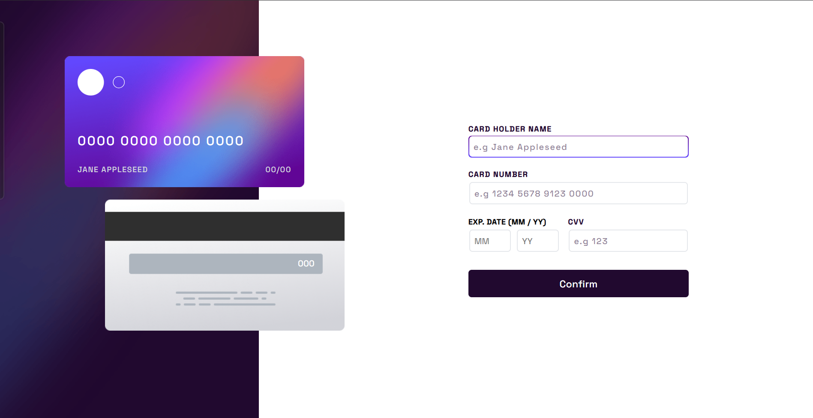
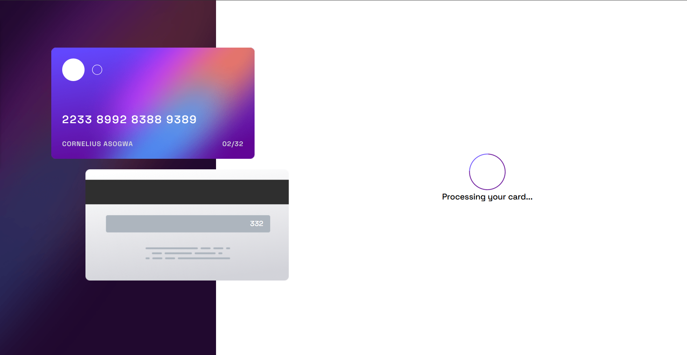
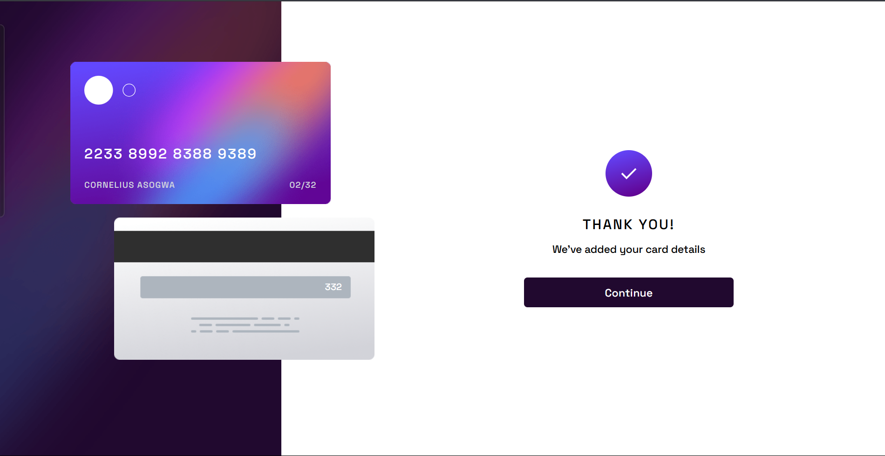
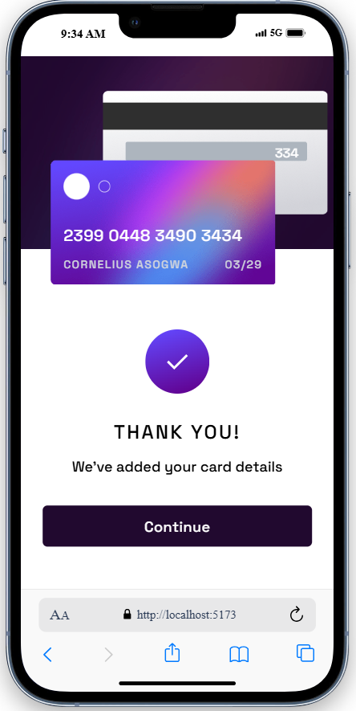
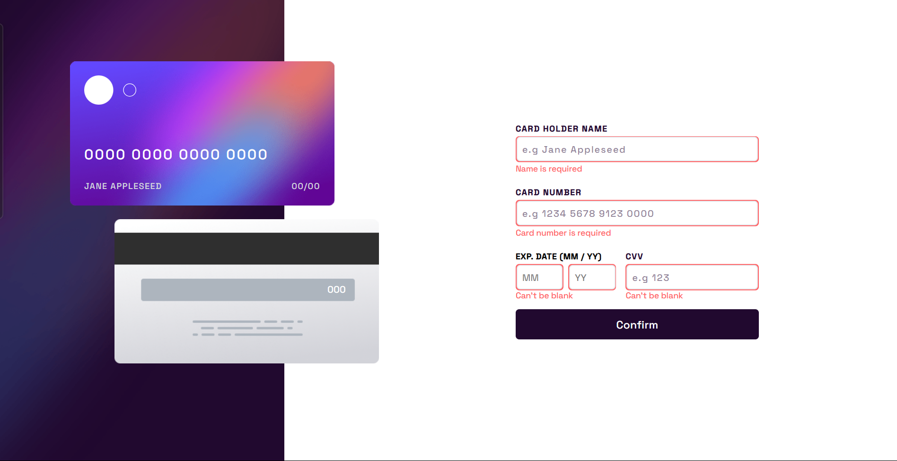
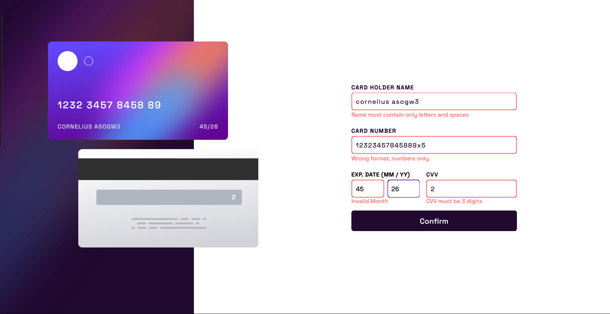

# Frontend Mentor - Interactive card details form solution

This is a solution to the [Interactive card details form challenge on Frontend Mentor](https://www.frontendmentor.io/challenges/interactive-card-details-form-XpS8cKZDWw). Frontend Mentor challenges help you improve your coding skills by building realistic projects.

## Table of contents

-  [Overview](#overview)
   -  [The challenge](#the-challenge)
   -  [Screenshot](#screenshot)
   -  [Links](#links)
-  [Installation & Setup](#installation--setup)
-  [My process](#my-process)
   -  [Built with](#built-with)
   -  [What I learned](#what-i-learned)
   -  [Continued development](#continued-development)
   -  [Useful resources](#useful-resources)
-  [Author](#author)

## Overview

### The challenge

Users should be able to:

-  Fill in the form and see the card details update in real-time
-  Receive error messages when the form is submitted if:
   -  Any input field is empty
   -  The card number, expiry date, or CVC fields are in the wrong format
-  View the optimal layout depending on their device's screen size
-  See hover, active, and focus states for interactive elements on the page

### Screenshots

#### Load/reload state



#### Processing state



#### Completed States




#### Error states




### Links

-  Solution URL: [Solution URL](https://github.com/corneliusweb/credit-card)
-  Live Site URL: [Cornelius Cards](https://cornelius-cards.vercel.app/)

## Installation & Setup

### Prerequisites

-  Node.js (v20 or higher)
-  pnpm (v10 or higher) or npm (v10 or higher)
-  Git

### Environment Setup

-  This project was created with pnpm, but you can use any package manager:

1. Clone the repository:

   ```bash
   git clone https://github.com/corneliusweb/credit-card.git
   cd credit-card
   ```

2. Install dependencies:

   ```bash
   pnpm install
   # or
   npm install
   ```

3. Start the development server:
   ```bash
   pnpm dev
   # or
   npm run dev
   ```

The application will be available at `http://localhost:5173`

## Available Scripts

In the project directory, you can run:

-  `pnpm dev` or `npm run dev`

   -  Runs the app in development mode
   -  Open [http://localhost:5173](http://localhost:5173) to view it in the browser
   -  The page will reload when you make changes

-  `pnpm build` or `npm run build`

   -  Builds the app for production to the `dist` folder
   -  It correctly bundles React in production mode and optimizes the build for the best performance
   -  The build is minified and the filenames include the hashes

-  `pnpm preview` or `npm run preview`

   -  Locally preview the production build
   -  Serves the built files from the `dist` folder

-  `pnpm lint` or `npm run lint`
   -  Runs ESLint to check for code quality issues

## My process

### Built with

-  [React](https://reactjs.org/) - JS library
-  [zod](https://zod.dev/) - Schema validation
-  [Tailwindcss v4.1](https://tailwindcss.com/) - CSS framework
-  Semantic HTML5 markup
-  Mobile-first workflow

### What I learned

I learned string formatting using regex. Also my first time using zod, so I learnt a lot of useful zod features and functionalities.
Using zod's `shape` to individually validate fields onChange, construct new error using the error messages provided by zod is one of the most intriguing thing I did in this project. See the code below:

```js
const singleFieldSchema = cardSchema.shape[name];
const result = singleFieldSchema.safeParse(value);

if (result.success) {
  setErrors((prevErrors) => {
    const newErrors = { ...prevErrors };
    delete newErrors[name]; // delete resolved errors if they exists
    return newErrors;
  });
} else {
  setErrors((prevErrors) => ({
    ...prevErrors,
    [name]: result.error.issues[0].message,
  }));
}
```

### Continued development

Having used zod for the very first time, I am in love with it already. So, I will continue digging deeper to becomes much more comfortable with using it.

### Useful resources

-  [Zod Validation in React (Full Tutorial)](https://www.youtube.com/watch?v=U9PYyMhDc_k) - This tutorial by Darius Cosden helped me kickstart my journey to understand zod. I really liked this pattern and will use it going forward.

## Author

-  Website - [corneliusweb](https://github.com/corneliusweb)
-  Twitter(X) - [@corneliusweb](https://x.com/corneliusweb_)
